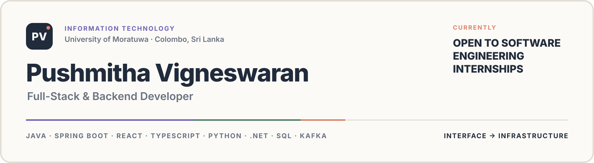

  <picture>
    <source media="(max-width: 700px)" srcset="./assets/profile-hero-minimal-mobile.svg" />
    
  </picture>

# Hi, I'm Pushmitha Vigneswaran

### Full-Stack & Backend Developer · Seeking Software Engineering Internships

I am an Information Technology undergraduate at the **University of Moratuwa**, building thoughtful digital systems from interface to infrastructure.

**Currently seeking software engineering internship opportunities.**

[Portfolio](https://pushmitha-portfolio.vercel.app) · [LinkedIn](https://www.linkedin.com/in/pushmitha-vigneswaran-979690301/) · [Email](mailto:vpushmitha20@gmail.com)

---

## About me

- Reading for a **BSc (Hons) in Information Technology** at the University of Moratuwa.
- Building full-stack products and service-based systems with **React, TypeScript, Java, Spring Boot, Python, .NET, SQL, and Kafka**.
- Interested in software engineering internships where I can connect reliable backend systems with accessible, well-crafted interfaces.

## Selected work

### [Fixflow](https://github.com/pushmitha20/Fixflow) — Service-based maintenance operations platform

An evolving full-stack system for coordinating maintenance requests, assignments, users, notifications, and operational analytics.

`React` `TypeScript` `Python` `.NET` `Kafka` `REST APIs` `SQL`

- Separates core workflows into focused services, including maintenance, assignments, users, notifications, analytics, and an API gateway.
- Uses Kafka-based events to connect service workflows.
- Includes automated tests across multiple backend services and a typed React frontend.

### [Developer Portfolio](https://github.com/pushmitha20/pushmitha-portfolio) — Interactive engineering portfolio

A responsive portfolio that presents my projects, technical journey, leadership, and engineering approach.

`Next.js` `TypeScript` `Tailwind CSS` `Framer Motion` `Vercel`

- Built with reusable components, reduced-motion support, and responsive layouts.
- Deployed on Vercel with a focused project and contact experience.
- **[View the live portfolio →](https://pushmitha-portfolio.vercel.app)**

### [React + Spring Boot E-commerce](https://github.com/pushmitha20/ecommerce-react-springboot) — Full-stack learning project

An e-commerce application connecting a React interface to a Spring Boot backend and an H2 database.

`React` `JavaScript` `Java` `Spring Boot` `REST APIs` `H2`

- Implements core product CRUD flows across the frontend and backend.
- Demonstrates API integration and persistent application data.

---

## Engineering toolkit

| Area | Technologies |
|---|---|
| **Languages** | Java, TypeScript, JavaScript, Python, C#, SQL, C |
| **Frontend** | React, Next.js, Tailwind CSS, responsive UI |
| **Backend** | Spring Boot, ASP.NET Core, Python APIs, REST API design |
| **Data & messaging** | PostgreSQL, MySQL, H2, Supabase, Kafka |
| **Delivery** | Git, GitHub, Docker, GitHub Actions, CI/CD, Vercel |
| **Design** | Figma, accessible interfaces, reduced-motion experiences |

## Leadership & community

- **Batch Representative** — Faculty of Information Technology, University of Moratuwa, Level 1.
- **Designing Lead** — IEEE WIE Futuro 4.0.
- **Designing Member** — IEEE WIE, University of Moratuwa.
- **Committee Support, OGV South** — AIESEC.

## Current focus

- Making **Fixflow** easier to run, test, and understand as a complete distributed system.
- Building stronger Spring Security, testing, system-design, and deployment skills.
- Contributing to collaborative codebases through clear issues, pull requests, reviews, and documentation.

---

### Let's build something meaningful

I am open to **software engineering internship opportunities** where I can contribute, learn from experienced engineers, and help ship useful products.

[View my portfolio](https://pushmitha-portfolio.vercel.app) · [Connect on LinkedIn](https://www.linkedin.com/in/pushmitha-vigneswaran-979690301/) · [Send me an email](mailto:vpushmitha20@gmail.com)

